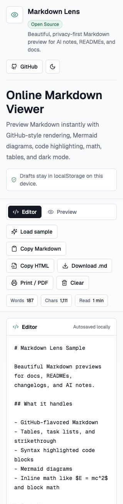

# Markdown Lens

A privacy-first, local document-to-Markdown workbench for PDF, Word, PowerPoint, Excel, HTML, EPUB, structured data, images, archives, READMEs, and developer writing.

[Live Demo](https://markdownlens.ayushdev.com) · [Report Bug](../../issues) · [Request Feature](../../issues)



Markdown Lens helps you convert common documents into editable Markdown, manage multiple private local documents, and review the result with clean GitHub-style rendering. It is built for developers, writers, and open-source maintainers who want a zero-install workflow without accounts, ads, analytics, or backend document uploads.

## Why Markdown Lens?

Markdown is everywhere: AI notes, project READMEs, technical specs, release notes, and developer journals. Many preview tools either feel dated, add distractions, or route content through services you may not want to use for private drafts.

Markdown Lens exists to provide a simple, polished, browser-first Markdown viewer that is pleasant enough for daily use and transparent enough for open-source review.

## Common Use Cases

- **Preview README drafts** before committing them to GitHub.
- **Clean up AI-generated Markdown** and check headings, lists, tables, and code fences.
- **Validate Mermaid diagrams and math** alongside the surrounding documentation.
- **Review changelogs and release notes** in a focused, readable layout.
- **Convert existing docs** from text-based PDF exports or `.docx` Word files into editable Markdown.
- **Export documentation** by downloading the Markdown or printing the rendered preview to PDF.

## Features

- Live Markdown editor and preview
- GitHub-flavored Markdown support, including tables, task lists, strikethrough, and autolinks
- Syntax highlighting for common code blocks
- Mermaid diagram rendering with safe fallback for invalid diagrams
- KaTeX math support for inline and block math
- Light and dark mode with local preference persistence
- Local draft autosave using `localStorage`
- Simple upload flow for Markdown, text-based PDFs, and Word `.docx` files
- Local PDF-to-Markdown import for digitally generated PDFs
- Local Word-to-Markdown import for `.docx` files
- Local PowerPoint `.pptx`, Excel `.xlsx`, HTML, CSV/TSV, JSON, XML, EPUB, image, and bounded ZIP import
- Optional local English OCR for PNG, JPEG, WebP, and BMP images
- Multi-document IndexedDB workspace with search, duplicate, trash, restore, backup, and autosave
- CodeMirror editor with line numbers, find/replace, command palette, resizable split view, and document outline
- Embedded DOCX and PPTX images stored as local document assets
- Conversion jobs with progress, cancellation, warnings, statistics, and conversion reports
- Privacy-preserving compressed share links stored only in the URL fragment
- Installable offline-capable PWA with safe update handling
- Copy raw Markdown
- Copy rendered HTML
- Download current content as a `.md` file
- Print or save the preview as PDF
- Split, editor-only, and preview-only modes
- Mobile-friendly editor and preview tabs
- Word count, character count, and estimated reading time
- Keyboard shortcuts for common editor actions
- A responsive [Markdown cheatsheet](https://markdownlens.ayushdev.com/markdown-cheatsheet)

## Keyboard Shortcuts

Markdown Lens supports the same shortcuts on macOS (`Cmd`) and Windows/Linux
(`Ctrl`). Shortcut hints are also available from the relevant toolbar controls.

| Action | Shortcut |
| --- | --- |
| Download Markdown | `Cmd/Ctrl + S` |
| Copy Markdown | `Cmd/Ctrl + Shift + C` |
| Copy rendered HTML | `Cmd/Ctrl + Shift + H` |
| Switch to Preview | `Cmd/Ctrl + Shift + P` |
| Switch to Editor | `Cmd/Ctrl + Shift + E` |
| Load sample Markdown | `Cmd/Ctrl + Shift + L` |

## Local-Only Privacy

Markdown Lens is designed to be privacy-first.

- Markdown is parsed and rendered directly in your browser.
- PDF and Word text extraction plus Markdown conversion also happen entirely in your browser.
- Drafts are saved only to that browser profile using `localStorage`.
- The app does not upload document content to a backend.
- There is no account, database, analytics, or tracking in v0.2.

Because drafts are stored by the browser, anyone with access to your device or browser profile may be able to view locally saved content. Clear the editor when you are done with sensitive notes.

### PDF and Word import limitations

Markdown Lens reads extractable text from every page of PDFs up to 100 MB. It infers common headings, paragraphs, lists, links, and code-like blocks, but PDF is a presentation format rather than a structured document format. Scanned PDFs still require a dedicated OCR workflow, and complex columns, diagrams, and visual table structure should be reviewed.

Markdown Lens also converts `.docx` Word documents up to 100 MB into editable GitHub-flavored Markdown. It preserves common headings, paragraphs, lists, tables, links, emphasis, strikethrough, superscript/subscript, footnote references, code-like blocks, and embedded images as local assets. Legacy `.doc` files are not converted in-browser; save or export them as `.docx` first.

## Tech Stack

- [Next.js](https://nextjs.org/) App Router
- [TypeScript](https://www.typescriptlang.org/)
- [Tailwind CSS](https://tailwindcss.com/)
- [lucide-react](https://lucide.dev/)
- [react-markdown](https://github.com/remarkjs/react-markdown)
- [remark-gfm](https://github.com/remarkjs/remark-gfm)
- [remark-math](https://github.com/remarkjs/remark-math)
- [rehype-katex](https://github.com/remarkjs/remark-math/tree/main/packages/rehype-katex)
- [rehype-highlight](https://github.com/rehypejs/rehype-highlight)
- [Mermaid](https://mermaid.js.org/)
- [PDF.js](https://mozilla.github.io/pdf.js/)
- [Mammoth](https://github.com/mwilliamson/mammoth.js)
- [Turndown](https://github.com/mixmark-io/turndown)

## Local Development

Clone the repository, install dependencies, and start the development server:

```bash
npm install
npm run dev
```

Open [http://localhost:3000](http://localhost:3000).

The development server does not register a service worker. Run `npm run test:pwa` to exercise the production service worker and verify offline editing/rendering in Chromium.

Useful checks:

```bash
npm run lint
npm run typecheck
npm run check:release
npm run build
npm run test:pwa
```

## Project Structure

```text
app/
  globals.css        Global styles, Markdown rendering styles, and print CSS
  layout.tsx         App metadata, fonts, and root layout
  page.tsx           Home route
components/
  markdown-lens-app.tsx
                    Main editor, preview, toolbar, and rendering experience
lib/
  pdf-import.ts      Lazy PDF.js extraction and import-state errors
  pdf-to-markdown.ts Positioned PDF text to Markdown conversion
  word-import.ts     Lazy Mammoth/Turndown DOCX import
  word-to-markdown.ts
                    Word HTML cleanup and GFM Markdown conversion
  utils.ts           Small shared utilities
public/
  screenshot.png     Current application screenshot
```

## Roadmap

- Add scanned-PDF OCR using the local worker pipeline
- Improve conservative PDF table and multi-column reconstruction
- Add more OCR language packs as optional same-origin assets
- Extract the converter registry into a reusable package for future CLI and MCP surfaces

## Contributing

Contributions are welcome. Please read [CONTRIBUTING.md](./CONTRIBUTING.md) before opening a pull request.

Good places to start include documentation improvements, accessibility checks, Markdown rendering edge cases, responsive UI polish, and small bug fixes.

## License

Markdown Lens is released under the [MIT License](./LICENSE).

Markdown Lens is an independent open-source project maintained in personal time.
